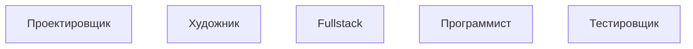

# Software Development: Clicker
Данная небольшая игра показывает жизнь разработчиков глазами стороннего наблюдателя.
Разработчики всех сортов трудятся над общей целью, вставая с рабочего места только лишь покушать.

###### Когда-нибудь здесь будет изображение игры.

## Уровни развития
Игра имеет три уровня развития:
1. Гараж — на данном уровне разработчики трудятся в небольшом помещении, не в лучших условиях, но ради общей цели.
2. Маленький офис — на самом деле офис не такой уж и маленький. Здесь разработчики могут позволить себе кухню, удобные офисные условия и несколько комнат.
3. Офисное здание — тут разработчики осознают, что ради общей цели можно работать из ~~дома~~ нескольких офисов, параллельно разрабытывая совсем разные программные решения, совсем разного уровня.

## Разработчики
Каждый сотрудник это проектировщик, художник, программист или же тестировщик. В редких случаях разработчик объединяет в себе все знания и становится Fullstack.

###### Библиотека Mermaid.js крутая.

Обычно разработчики трудятся сами, но можно ускорить их кликом. Клик на разработчика существенно ускоряет его работу. 
Но не обязательно постоянно кликать на них, им это не нравится. Лучше улучшить их рабочие условия, купив более мощное оборудование ***(улучшение)*** или же изменив условия офиса
***(улучшение)***. А ещё сотрудники любят кушать, так что просто купи ему еды ***(кухня)***.

Удивительно, что разработчики работают за идею, а не за зарплату.

## Сюжет
Игра начинается в гараже с одним Fullstack-разработчиком.
Как-то ему удалось набрать популярность в мире IT, из-за чего заказы на разработку текут рекой прямо к нему в гараж.
Как вознаграждение за выполненный заказ дают немного денег и очень редко дают премиум валюту.
Их можно потратить на ~~покупку раба~~ найм нового работника, улучшение рабочих условий или же переход на новый уровень.

## Как выглядит структура
+ игра
  + офис (улучшается)
    + комната
      + рабочее место (улучшается)
        + разработчик
      + рабочее место (улучшается)
    + комната
      + рабочее место (улучшается)
      + рабочее место (улучшается)
  + офис (улучшается)
    + комната
      + рабочее место (улучшается)
        + разработчик
      + рабочее место (улучшается)
        + разработчик
      + ...
    + ...
  + ...

## Что предстоит сделать?
- [X] Написать README.md
- [ ] Модель
  - [X] Основа модели, структуры, классы
  - [X] События
  - [ ] Сохранение и загрузка
    - [ ] Сериализация
    - [ ] Десериализация
  - [ ] Обработка смены времени на устройстве
    - [ ] Сохранение ключевых точек времени
    - [ ] Интерполяция по точкам в случае попадания в пройденное время
  - [ ] Баланс
    - [ ] Объединить все константы в один файл
    - [ ] Выбрать подходящие значения
- [ ] Интерфейс
  - [ ] Текстуры
  - [ ] Макет
  - [ ] Связать с моделью
  - [ ] Адаптер между моделью и интерфейсом
    - [ ] Анимация базовыми средствами
    - [ ] Анимация через аниматора
- [ ] Опубликовать
  - [ ] Аккаунт разработчика
  - [ ] Иконка, картинки игры
  - [ ] Завлекающее описание
  - [ ] Реклама

## Я хочу помочь
:heavy_multiplication_x: Что? Денюшшшки?

:heavy_check_mark: Может быть ты имел ввиду энтузиазм?

Пиши на почту dioman172@yandex.ru - что, как, зачем, почему и постарайся не попасть в спам.

###### А вообще у нас должно быть название, типа как у студии, но оно пока никакое.

###### Место для вашей рекламы.
